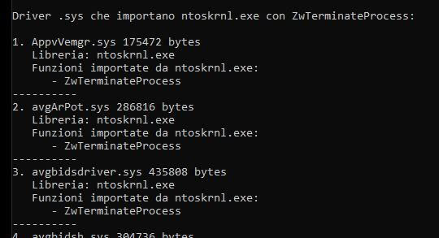

# DriverScanner

Windows driver analysis tool that scans `.sys` files for imports of the `ZwTerminateProcess` API from the `ntoskrnl.exe` kernel, identifying potential kernel-mode process termination vectors.

## Build Instructions (Windows - CMD)

### Prerequisites
- Python installed on Windows
- Python added to the system PATH

### Compile the executable

Open **Command Prompt (cmd)** and run:

```cmd
pip install pyinstaller

pyinstaller --onefile DriverScanner.py

```


